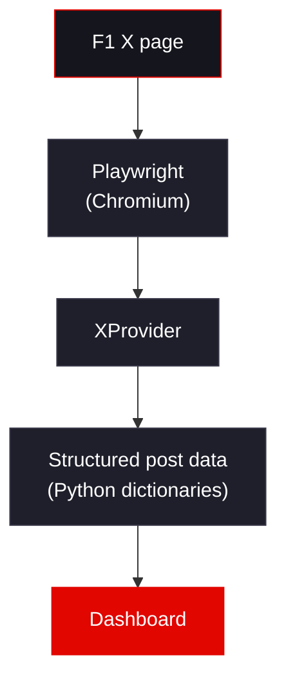
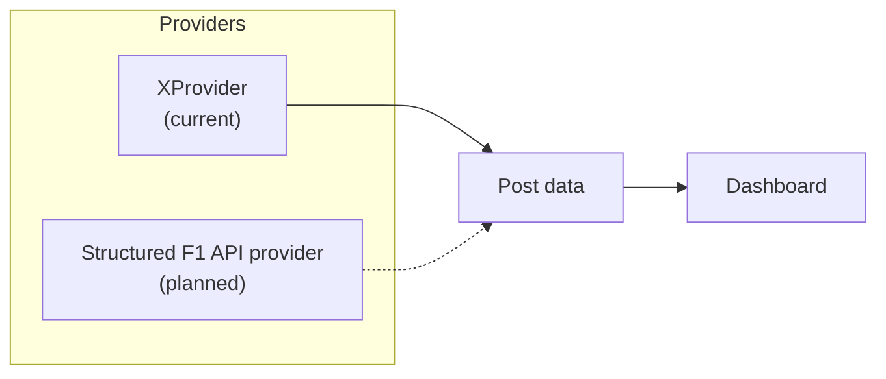

<div align="center">

<br>

```
 ____  _ _ __        __    _ _
|  _ \(_) |\ \      / /_ _| | |
| |_) | | __\ \ /\ / / _` | | |
|  __/| | |_ \ V  V / (_| | | |
|_|   |_|\__| \_/\_/ \__,_|_|_|
```

### A focused Formula 1 feed and dashboard for the Linux desktop

Follow the updates that matter across the whole race weekend, without scrolling a social-media timeline.

<br>


<br>

[**Why PitWall?**](#why-pitwall) &nbsp;·&nbsp;
[**Current Status**](#current-status) &nbsp;·&nbsp;
[**How It Works**](#how-it-works) &nbsp;·&nbsp;
[**Install**](#installation) &nbsp;·&nbsp;
[**Roadmap**](#roadmap) &nbsp;·&nbsp;
[**Limitations**](#known-limitations)

<br>

</div>

---

## Overview

**PitWall** is a Python-based F1 feed and dashboard, built primarily for Linux users. It collects recent posts from the official Formula 1 account on X, converts them into structured Python data, and presents them in a clean, searchable dashboard.

It is a **working MVP / prototype**. It collects and presents F1 posts. It is **not** a live timing system, and this README is explicit about where that line sits.

<div align="center">

| | |
|:---|:---|
| **What it is** | A post collector and dashboard for F1 updates |
| **What it is not (yet)** | A live timing, telemetry, or session-intelligence tool |
| **Data source today** | Official Formula 1 X page, via Playwright |
| **Data source tomorrow** | Structured F1 data sources and APIs (planned) |

</div>

---

## Why PitWall?

Most F1 attention goes to Qualifying and the Race. But **FP1, FP2 and FP3** often carry useful signal: incidents, team updates, and early developments that shape the rest of the weekend.

Following that through a normal social-media feed means opening an app, scrolling past unrelated content, and filtering by eye. PitWall exists to skip that step: a focused view of F1 updates, available from a Linux environment.

The project is being developed **incrementally**. The goal for this stage was simple: get one real data source flowing end to end into a usable UI, and keep the core small enough to change.

---

## Current Status

<table>
<tr>
<td width="50%" valign="top">

### Implemented

- Chromium launched through Playwright
- Official Formula 1 X page opened
- Posts located on the page
- Post **text**, **timestamp**, **URL** extracted
- Attached **image URLs** extracted
- Posts without images handled
- Structured dictionaries returned
- Posts passed to the dashboard
- Dashboard with search / filtering
- Newest-first sorting
- Empty-image states
- Tested against real F1 posts

</td>
<td width="50%" valign="top">

### Not implemented

- Live FP1 / FP2 / FP3 timing
- Telemetry
- FIA data
- Weather
- Race control messages
- Real-time session intelligence
- Automatic refresh
- Notifications
- Terminal mode

See the [Roadmap](#roadmap) for what is planned.

</td>
</tr>
</table>

---

## How It Works

The current pipeline is deliberately linear:



**1. Browse.** Playwright launches Chromium and opens the official Formula 1 X page.
**2. Extract.** `XProvider` locates posts and pulls out text, timestamp, URL and image URLs.
**3. Structure.** Each post becomes a plain Python dictionary.
**4. Present.** The dashboard receives the collected posts and renders them.

### Post structure

```python
{
    "text": "...",
    "timestamp": "...",
    "url": "...",
    "image_url": [
        "..."
    ]
}
```

Posts without images return an empty image list, and the dashboard renders an explicit empty-image state.

### Why a provider abstraction?

X is a fragile data source: its DOM is dynamic and can change without notice. PitWall isolates all source-specific logic inside a **provider**, so the rest of the application only ever sees the post structure above.



Replacing or complementing the X implementation with a structured F1 data source means writing a new provider that returns the same shape. It should not require rewriting the dashboard.

---

## Feature Overview

<table>
<tr>
<td align="center" width="25%">
<b>Collector</b><br><br>
Playwright-driven extraction of posts from the official F1 X page
</td>
<td align="center" width="25%">
<b>Structured Data</b><br><br>
Text, timestamp, URL and image URLs in plain Python dictionaries
</td>
<td align="center" width="25%">
<b>Dashboard</b><br><br>
Clean post presentation with images, links, and timestamps
</td>
<td align="center" width="25%">
<b>Search and Sort</b><br><br>
Filter posts, newest first, with empty-image handling
</td>
</tr>
</table>

---

## Tech Stack

| Layer | Technology |
|:---|:---|
| Language | Python |
| Browser automation | Playwright (Chromium) |
| Data model | Python dictionaries (`models/post.py` present in the layout) |
| Presentation | Python dashboard (`dashboard/app.py`) |
| Installers | `install.sh` (Linux), `install.ps1` (PowerShell) |

---

## Project Structure

```text
PitWall/
├── cache/
│   └── images/
├── pitwall/
│   ├── __init__.py
│   ├── main.py
│   ├── config.py
│   ├── providers/
│   │   ├── __init__.py
│   │   └── x_provider.py      # current data source
│   ├── models/
│   │   ├── __init__.py
│   │   └── post.py
│   ├── services/
│   │   ├── __init__.py
│   │   ├── fetch.py
│   │   ├── images.py
│   │   └── cache.py
│   └── dashboard/
│       ├── __init__.py
│       └── app.py
├── install.sh
├── install.ps1
├── requirements.txt
├── README.md
└── LICENSE
```

> The layout above is the project's current shape. The project is evolving, so some modules (notably under `services/` and `cache/`) are scaffolding for planned work such as local media caching and are not claimed as finished features.

---

## Installation

> PitWall is primarily built for Linux. An `install.ps1` script is also included in the repository.

```bash
git clone https://github.com/<your-username>/PitWall.git
cd PitWall
./install.sh
```

<details>
<summary><b>Manual installation</b></summary>

<br>

```bash
git clone https://github.com/<your-username>/PitWall.git
cd PitWall

python -m venv .venv
source .venv/bin/activate

pip install -r requirements.txt
playwright install chromium
```

Playwright needs a Chromium build to drive, which is what the last command installs.

</details>

---

## Usage

```bash
python -m pitwall.main
```

This runs the pipeline: launch Chromium, collect posts from the F1 X page through `XProvider`, and hand them to the dashboard.

> Adjust the command above if your entry point differs from `pitwall/main.py`.

---

## Configuration

Settings live in `pitwall/config.py`. Check that file for the options currently exposed; configuration is still evolving alongside the architecture.

---

## Screenshots

<div align="center">

<!-- Replace with real screenshots, e.g. docs/screenshots/dashboard.png -->

| Dashboard |
|:---:|
| *Screenshot coming soon* |

</div>

---

## Known Limitations

<table>
<tr>
<td valign="top" width="50%">

**X is not an ideal data source**

The provider relies on Playwright and X's web interface. X's DOM is dynamic and can change, so selectors are potentially fragile.

</td>
<td valign="top" width="50%">

**Social-media data is noisy**

Posts include hashtags, emojis, promotional language and other formatting that is poorly suited to structured F1 information.

</td>
</tr>
<tr>
<td valign="top" width="50%">

**Not a live timing system**

PitWall does not currently provide live session timing, telemetry, FIA data, weather, race control, or real-time session intelligence.

</td>
<td valign="top" width="50%">

**Proof-of-concept provider**

The X provider is primarily a proof of concept. The intended direction is to replace or complement it with structured F1 data sources and APIs.

</td>
</tr>
</table>

The architecture is intentionally evolving. The current priority is keeping the core simple and working before adding advanced features.

---

## Roadmap

**Implemented**

- [x] Playwright-based X provider
- [x] Structured post dictionaries (text, timestamp, URL, image URLs)
- [x] Dashboard with post text, timestamps, images and links
- [x] Search / filtering
- [x] Newest-first presentation
- [x] Empty-image states

**Planned (not yet implemented)**

- [ ] Structured F1 API integration
- [ ] Session detection: FP1 / FP2 / FP3 / Qualifying / Sprint / Race
- [ ] Automatic refresh
- [ ] New-post detection
- [ ] Local media caching
- [ ] Terminal mode
- [ ] Session timelines
- [ ] Driver / team filtering
- [ ] Race-control information
- [ ] Weather data
- [ ] Notifications
- [ ] "What did I miss?" session summaries
- [ ] Integration with historical F1 datasets
- [ ] Advanced F1 analytics

---

## Contributing

Contributions, issues and ideas are welcome. Because the project is an early MVP, the most useful things right now are:

- Reports of selector breakage when X's layout changes
- Ideas for structured F1 data sources
- Feedback on the provider interface

Please open an issue to discuss larger changes before submitting a pull request.

---

## License

Distributed under the terms of the license in [`LICENSE`](LICENSE).

---

## Project Status

PitWall is currently a working MVP/prototype focused on collecting and presenting F1 posts. The project is evolving toward a structured F1 session information tool.

<div align="center">
<br>
<sub>Built incrementally. Provider first, dashboard second, timing later.</sub>
</div>
